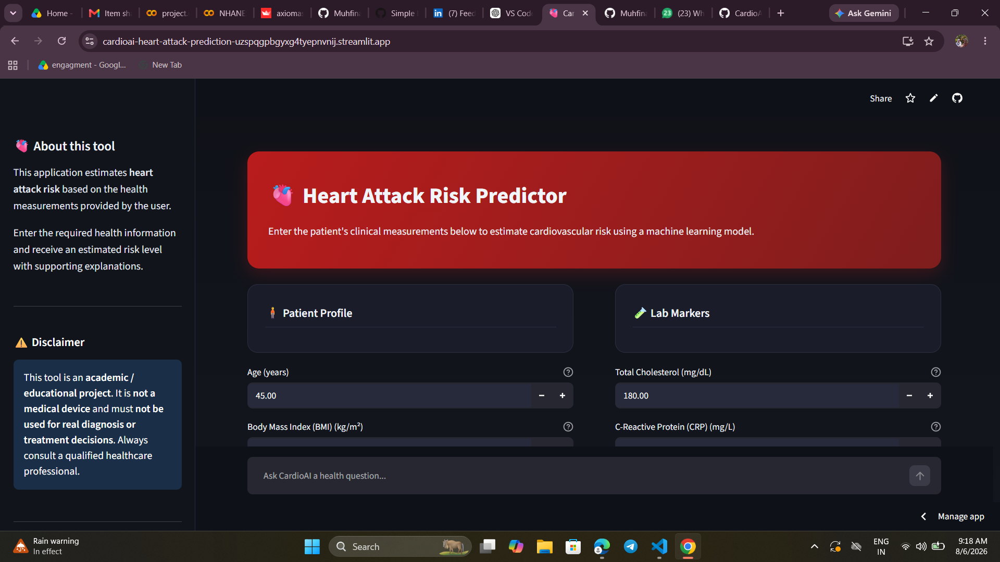
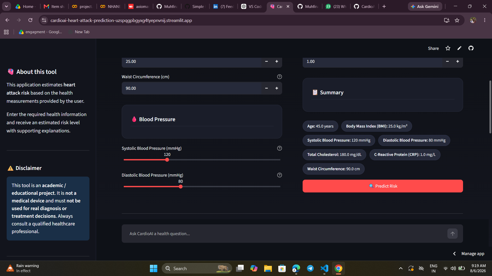
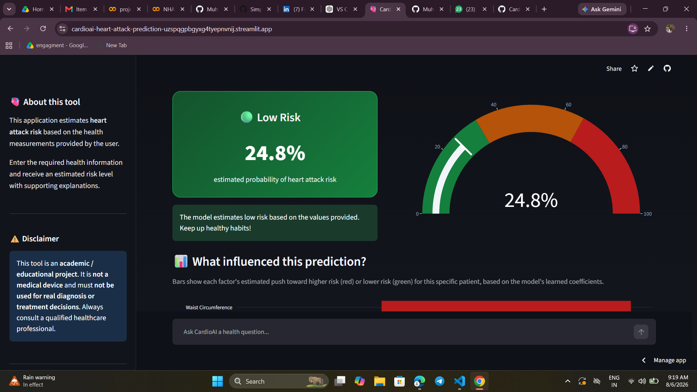
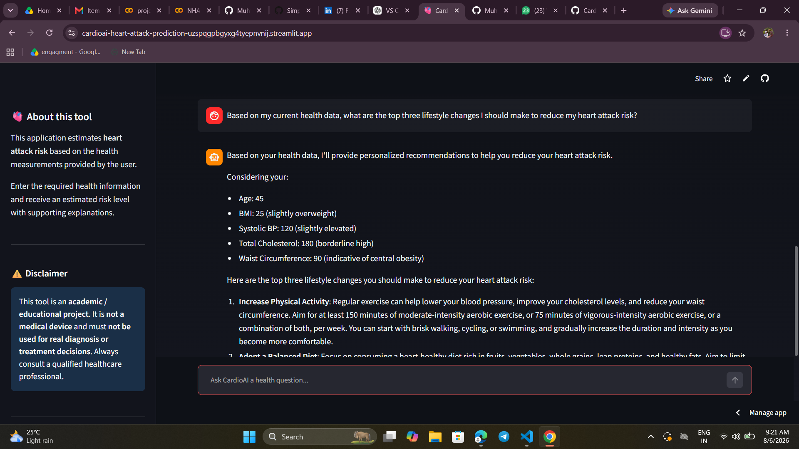

# ❤️ CardioAI – Heart Attack Risk Prediction System

An AI-powered web application that predicts the risk of heart attack using Machine Learning and provides personalized health recommendations through the Groq LLM.

---

## 🌐 Live Demo

🔗 https://cardioai-heart-attack-prediction-uzspqgpbgyxg4tyepnvnj.streamlit.app/

---

## 📌 Features

- 🫀 Predicts heart attack risk using a trained Machine Learning model
- 📊 Interactive and user-friendly Streamlit interface
- 📈 Visual explanation of prediction factors
- 🤖 AI Health Assistant powered by Groq LLM
- 💡 Personalized lifestyle recommendations
- 📱 Responsive and modern UI
- ⚠️ Educational disclaimer for responsible AI usage

---

## 🛠️ Tech Stack

- Python
- Streamlit
- Scikit-learn
- Pandas
- NumPy
- Plotly
- Joblib
- Groq API

---

## 📂 Project Structure

```
cardioai-heart-attack-prediction/
│
├── models/
│   ├── heart_attack_model.pkl
│   └── feature_names.pkl
│
├── screenshots/
│   ├── home_page.png
│   ├── patient_input.png
│   ├── prediction_result.png
│   └── ai-health-assistant.png
│
├── app.py
├── requirements.txt
├── README.md
└── .gitignore
```

---

## 🚀 Installation

Clone the repository

```bash
git clone https://github.com/Muhfinap/cardioai-heart-attack-prediction.git
```

Go into the project

```bash
cd cardioai-heart-attack-prediction
```

Install dependencies

```bash
pip install -r requirements.txt
```

Create a `.env` file

```env
GROQ_API_KEY=your_groq_api_key
```

Run the application

```bash
streamlit run app.py
```

---

# 📸 Screenshots

## 🏠 Home Page



The application welcomes users with a clean dashboard where they can enter patient information for heart attack risk prediction.

---

## 📝 Patient Health Input



Users can enter clinical measurements such as:

- Age
- BMI
- Waist Circumference
- Blood Pressure
- Total Cholesterol
- C-Reactive Protein (CRP)

A summary panel displays all entered information before prediction.

---

## 📊 Prediction Result & Feature Importance



After prediction, the application displays:

- Risk Level
- Prediction Probability
- Interactive Risk Gauge
- Feature Importance Graph
- Explanation of influential health factors

---

## 🤖 AI Health Assistant



The integrated Groq-powered AI assistant provides:

- Personalized health recommendations
- Lifestyle improvement suggestions
- Answers to heart health questions
- Educational guidance based on the user's health data

---

## ⚠️ Disclaimer

This project is developed for **educational and research purposes only**.

It is **not a medical device** and should **not** be used for diagnosis or treatment decisions.

Always consult a qualified healthcare professional.

---

## 👩‍💻 Author

**Muhfina PP**

GitHub: https://github.com/Muhfinap

LinkedIn: *(www.linkedin.com/in/
muhfinapp)*

---

## ⭐ Support

If you found this project helpful, consider giving it a ⭐ on GitHub.
